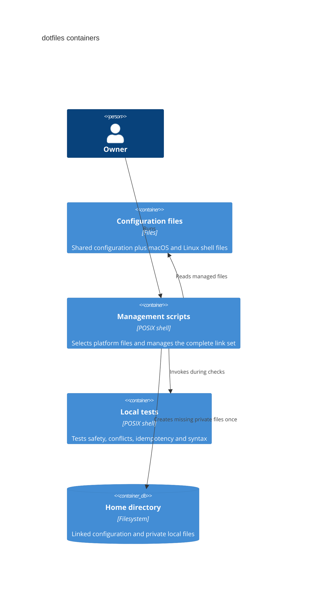

# C2: Containers

The scripts select `shell-macos` or `shell-linux` and preflight every managed
file link. Kitty is macOS-only. Platform detection never runs inside Zsh. The
installer links Git, tmux, and Neovim files below `~/.config` and links
`AGENTS.md` into existing tool directories. `~/.secrets.zsh`,
`~/.git-credentials`, and `config.local` remain ordinary local files.
