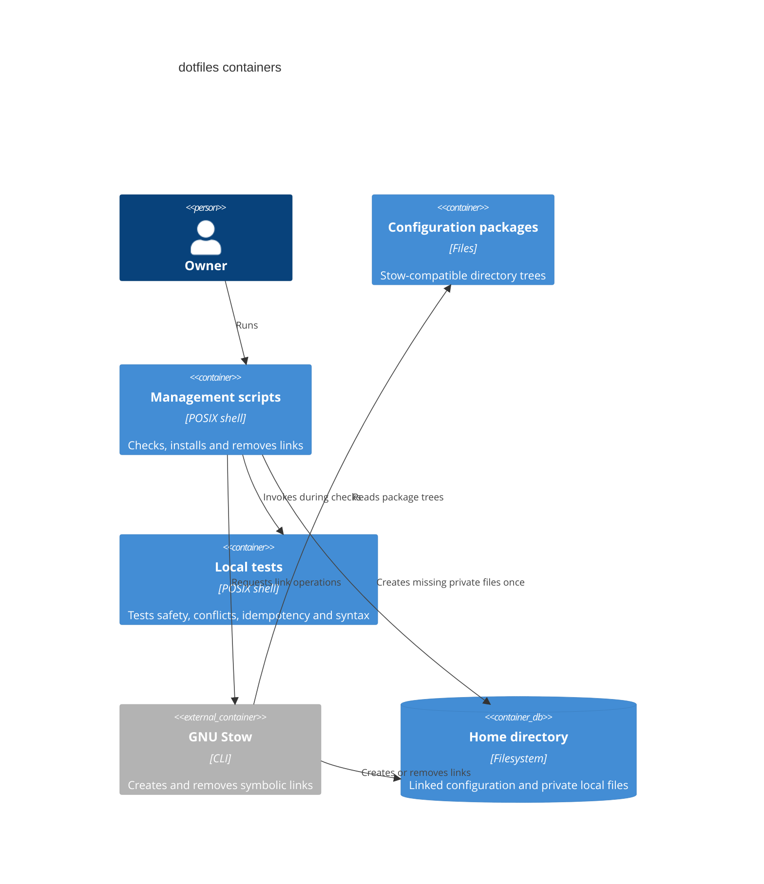

# C2: Containers

```mermaid
C4Container
    title dotfiles containers
    Person(owner, "Owner")
    Container(repo, "Configuration packages", "Files", "Stow-compatible directory trees")
    Container(scripts, "Management scripts", "POSIX shell", "Checks, installs and removes links")
    Container(tests, "Local tests", "POSIX shell", "Tests safety, conflicts, idempotency and syntax")
    Container_Ext(stow, "GNU Stow", "CLI", "Creates and removes symbolic links")
    ContainerDb(home, "Home directory", "Filesystem", "Linked configuration and private local files")

    Rel(owner, scripts, "Runs")
    Rel(scripts, tests, "Invokes during checks")
    Rel(scripts, stow, "Requests link operations")
    Rel(stow, repo, "Reads package trees")
    Rel(stow, home, "Creates or removes links")
    Rel(scripts, home, "Creates missing private files once")
```

The scripts preflight the complete Stow operation before mutation. GNU Stow
owns only symbolic links; `secrets.zsh` and `config.local` remain ordinary local
files.
