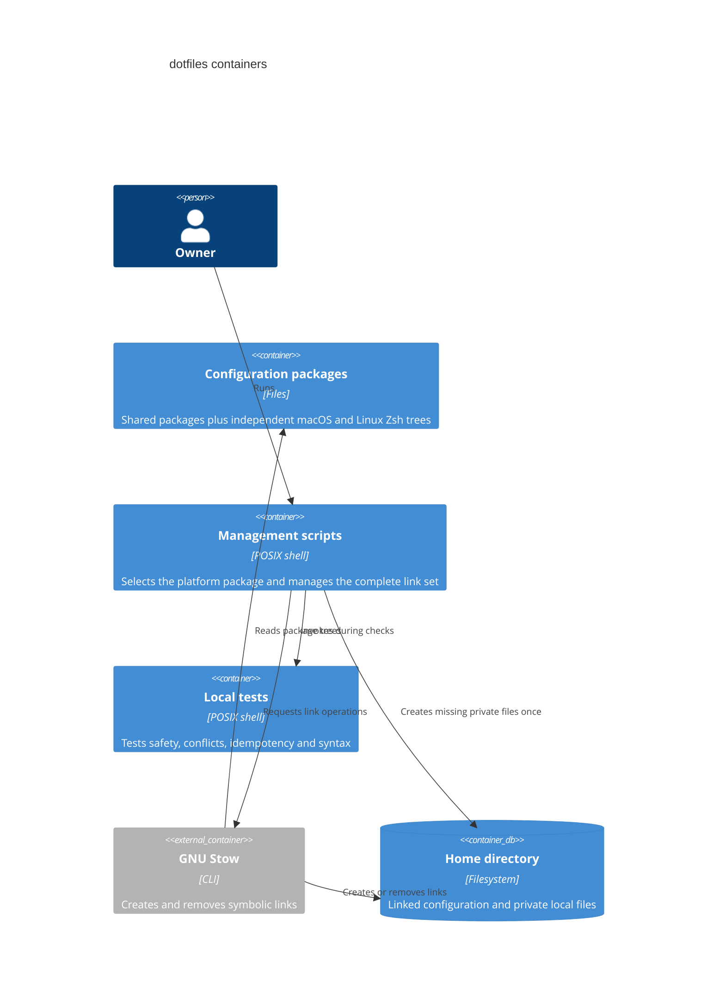

# C2: Containers

The scripts select `shell-macos` or `shell-linux`, combine it with every shared
package, and preflight the complete Stow operation. Platform detection never
runs inside Zsh. GNU Stow owns only symbolic links; `secrets.zsh` and
`config.local` remain ordinary local files.
