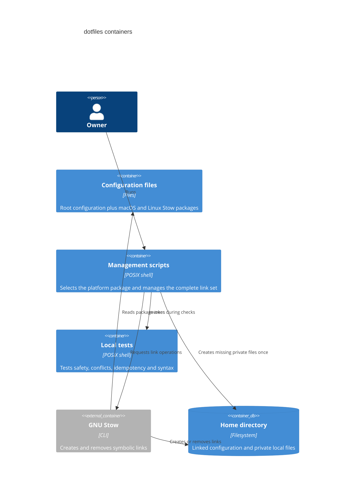

# C2: Containers

The scripts select `shell-macos` or `shell-linux` and preflight the applicable
Stow packages and direct links. Kitty is macOS-only. Platform detection never
runs inside Zsh. The installer links root Git, Vim, and tmux files into home and
links `AGENTS.md` into existing tool directories. `~/.secrets.zsh`,
`~/.git-credentials`, and `config.local` remain ordinary local files.
