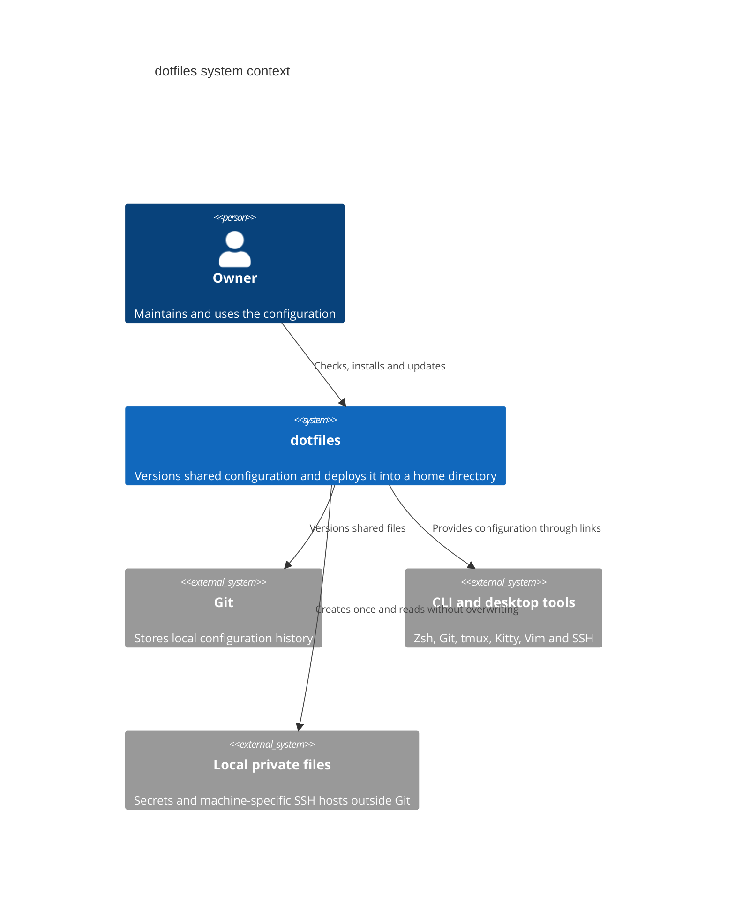

# C1: System Context

The dotfiles system lets its owner keep consistent command-line and development
tool configuration across macOS and Linux without putting credentials in Git.

```mermaid
C4Context
    title dotfiles system context
    Person(owner, "Owner", "Maintains and uses the configuration")
    System(dotfiles, "dotfiles", "Versions shared configuration and deploys it into a home directory")
    System_Ext(git, "Git", "Stores local configuration history")
    System_Ext(tools, "CLI and desktop tools", "Zsh, Git, tmux, Kitty, Vim and SSH")
    System_Ext(local, "Local private files", "Secrets and machine-specific SSH hosts outside Git")

    Rel(owner, dotfiles, "Checks, installs and updates")
    Rel(dotfiles, git, "Versions shared files")
    Rel(dotfiles, tools, "Provides configuration through links")
    Rel(dotfiles, local, "Creates once and reads without overwriting")
```
